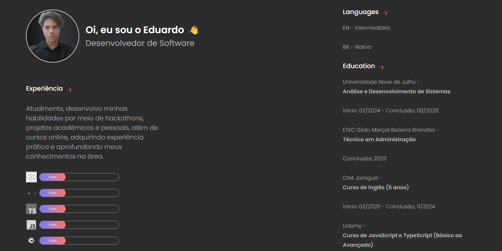

# Meu Portfólio Pessoal

Bem-vindo ao repositório do meu portfólio pessoal! 🎉  
Este projeto foi desenvolvido com o objetivo de apresentar meus trabalhos e habilidades, utilizando tecnologias modernas como **Next.js**, **TypeScript** e **Sass**.  

---

## 🚀 Tecnologias Utilizadas

- **[Next.js](https://nextjs.org/):** Framework React para renderização server-side e geração de sites estáticos.  
- **[TypeScript](https://www.typescriptlang.org/):** Superset do JavaScript que adiciona tipagem estática ao código, ajudando a evitar erros e aumentar a produtividade.  
- **[Sass](https://sass-lang.com/):** Um poderoso pré-processador CSS que facilita a criação de estilos de maneira modular e reutilizável.  

---

## 💡 Objetivos do Projeto

O principal objetivo deste portfólio foi criar uma página moderna, simples e funcional, onde eu pudesse consolidar o aprendizado dessas tecnologias. Além disso, o projeto me permitiu explorar boas práticas de desenvolvimento e conceitos fundamentais dessas ferramentas.

---

## 🌟 Funcionalidades

✅ Página inicial apresentando informações sobre mim.  
✅ Layout responsivo, adaptado para diferentes tamanhos de tela.  

---

## 📚 O que Aprendi

Durante o desenvolvimento deste projeto, tive a oportunidade de aprender e aplicar:  
1. Configuração e estrutura de um projeto Next.js.  
2. Tipagem estática e componentes tipados com TypeScript.  
3. Estilização modular e reutilizável utilizando Sass.  

---

🚀 **Sinta-se à vontade para explorar, contribuir e deixar seu feedback!**  
